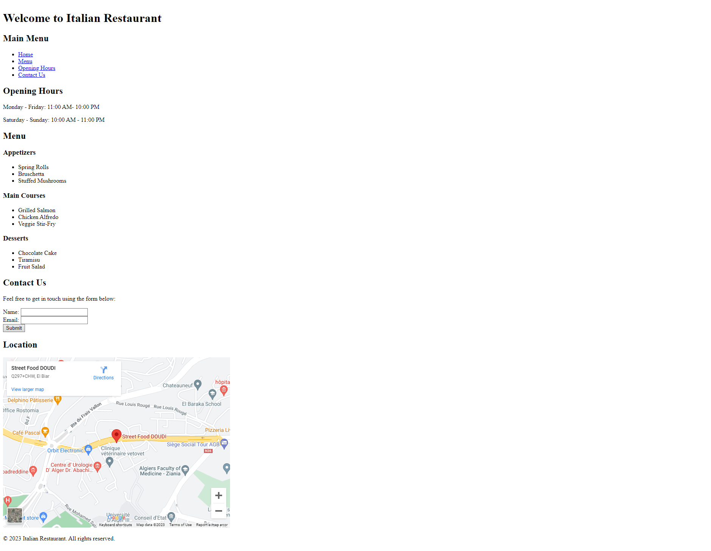

# Restaurant Website Exercise

## Goal

The goal of this exercise is to create a restaurant website using HTML using the proper HTML semantics.

## Page Screenshot

## Instructions

1. Create a new folder called `restaurant`
2. Create a new file called `index.html` inside the `restaurant` folder
3. Right click on the `restaurant` folder and select `Open with Live Server` to open the `index.html` file in the browser
4. Create the HTML structure for the restaurant website using the proper HTML semantics based on the screenshot above
5. Once you are happy with the result, upload the `restaurant` folder to your GitHub repository

## Resources

- [HTML Semantic Elements][w3]
- [HTML Semantic Elements - MDN][def]

## Do Your Research

- How to embed a google map in a website hint `<iframe>` tag and google maps

[def]: https://developer.mozilla.org/en-US/docs/Glossary/Semantics#Semantics_in_HTML
[w3]: https://www.w3schools.com/html/html5_semantic_elements.asp

## Learned in this Exercise

- Getting more familiar with HTML syntax
- HTML Semantic Elements
- HTML Semantic Elements - MDN
- How to embed a google map in a website hint `<iframe>` tag and google maps
- How to use the `<header>` tag
- How to use the `<nav>` tag
- How to use the `<main>` tag
- How to use the `<section>` tag
- How to use the `<article>` tag
- How to use the `<footer>` tag
- How to initialize a git repository
- How to add files to the staging area
- How to commit files
- How to push files to GitHub
- How to create a GitHub repository from the browser
